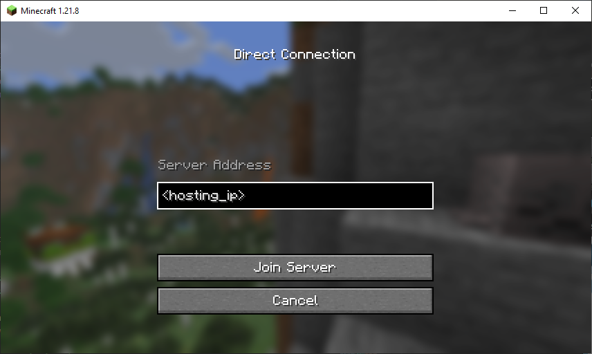

# Minecraft Manager
***Peter Vanderhyde***  
*2024 - Present*

## Description
This is a Java Minecraft server manager that allows for basic control of a server being run on a host's Windows machine. Anyone on the same network as the host can connect to the manager and startup worlds on the server. The host can set up multiple worlds so that clients can select which world to play in. It will even handle worlds that are different versions, different settings, or using Fabric to run mods on certain worlds.
  

## Features
Through this manager, both the host and clients have the ability to
- Start the world they've selected in the dropdown.
- Stop the currently running server.
- Query the current players on the server.
- Query the current status of the server including the version and the world name.
- Chat with others connected to the manager.
- Download mods directly from the host. The host can select mods for each Fabric world that can be downloaded from them.
  
The host has the ability to
- Choose what worlds they would like the clients to be able to choose from (including worlds running Fabric.)
- Add existing Minecraft worlds to the world list, or remove/delete worlds.
- Create new worlds from scratch to be directly added to the list. Use any version/snapshot, gamemode, difficulty, world preset, and optionally set a seed. A world can also be signified as a Fabric world that will run any mods in the world's mod folder.
  > **Note**:  
  Newly created worlds do not generate any world files until their first time being run.
- Easily backup server worlds.
- Close the manager, but leave the server running.
- Update worlds to newer versions.
- Quickly access each world's mods folder.
- Download mods and designate them as recommended for playing on a world. Clients can download these mods directly from the host.
- Directly edit each world's properties in the GUI.
- Change a few settings that are universal across all worlds.
  - Enable/Disable the whitelist.
  - Add usernames to the whitelist.
  - Set the view distance.
  - Set the simulation distance.
- Get server log updates in real time.
- Send commands directly to the server.
- Send chat messages to players on the server.
- See all player chat messages.
- See basic memory percentage statistics about the server.
- The host and clients automatically receive updates when players join and leave the server without having to refresh.
- The host can click player's names in the list to perform specific actions on them such as whitelisting, kicking, etc.

### Extra Features
For all versions starting at snapshot 25w35a (1.21.9), servers provide an API to receive notifications from the server, and also to send commands to the server. This means there are more features available for those worlds.
- The host is informed each time the whitelist, ban, or op status of a player changes.
- Toggling the whitelist and changing the view/simulation distance through the GUI immediately applies the changes to the server world through the API.

## Host Instructions
If you are hosting the server on your computer, you must have your `Minecraft Manager` program running for others to be able to control the server. You will need the latest Java Runtime (JRE) in order to run the server, so download one if you do not already have it. Different versions require different minimum JRE versions. You can download the latest JRE from [Adoptium Temurin](https://www.adoptium.net/temurin/releases/).  
>**MAKE SURE** you are downloading the **JRE** MSI version, not the **JDK !!**

### Initial Startup
Run the `Minecraft Manager.exe` file.  
The first time you select the host mode, it will prompt you to enter the path of the server folder.  
Create an empty folder somewhere, then select `Browse` in the manager to navigate to it.  
Once you hit `Create New`, the program will automatically download the latest server.jar and begin setting up the server folder automatically.  
After the folder is setup, you will be prompted to accept the EULA and enter the IP address to host the server on.
  

### Accept the EULA
  
### Hosting IP
  

### Joining the Server
  
  
To join the server world, clients must direct connect to the host's IP address.
  
### Adding Worlds
You can add/create as many worlds as you would like to. The manager will run each of them in their own version. You can mix and match Fabric servers as well. The manager will download the appropriate fabric-server.jar to run.  
When adding an existing world, place the world folder in the `worlds` folder located in the server folder. Inside the manager, go to `World Manager`, `Add Existing`, and select the world folder in the file explorer. Select the correct version and any desired settings.

## **\*Optional\* Customizing the Batch File**  
There are several extra options that can be given in the server run command such as defining memory space for the server. Feel free to add any extra arguments to the `run.bat` file found in the server folder. If the run batch file has not already been created, the program will create it upon starting a world. 

### You're all set now. Enjoy!
