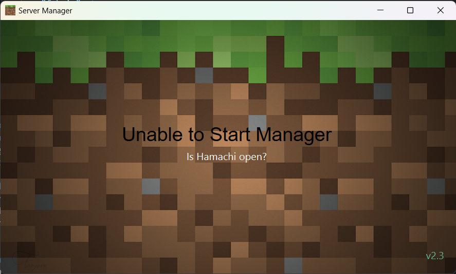

# Minecraft Manager
***Peter Vanderhyde, 2024***

## Description
This is a Java Minecraft server manager that allows for basic control of the server being run on a host's machine by the host and others on the same network. If the host has multiple server worlds available on their machine, clients can select a world to run. It will even handle worlds that are different versions.
  


## Features
Through this manager both the host and clients will have the ability to
- Start an available world in the dropdown
- Stop or restart a currently running server
- Query the current players on the server
- Query the current status of the server including the version and the world name
- Chat with others connected to the manager
  
The host has the ability to choose what worlds he would like the clients to be able to choose from, including worlds running fabric mods.

## Host Instructions
If you are hosting the server on your computer, you must have your manager_host program running for others to be able to control the server. You will need a Java Runtime (JRE) in order to run the server, so download one if you do not already have it. Different versions require different minimum JRE versions.
  
### Step 1
**<u>\*Optional\* Creating the Server Folder</u>**  
If you wish to manually create a server folder for the program, you will need to download a `server.jar` file to execute. [MCVersions.Net](https://mcversions.net/) is the simplest place to find any server version. If you need instructions on how to set up the server, there are several resources online that you can easily find.

### Step 2
**<u>Initial Startup</u>**  
Run the `Host_manager.exe` file. The first time you run the manager, it will prompt you to enter the path of the server folder. This can either be the server folder you created in the previous optional step, or you can let the program download and run the latest server file automatically.

If you set up the folder automatically, it will also prompt you to accept the eula.txt.

If you see the error. Once you have run the program, it will have created a file called `manager_settings.json`. Inside this settings file, it will save the IP you are hosting from (defaults to localhost), the displayed names of the clients connecting to your manager, the server path, and will store the names of the server worlds you choose. 

#### Example manager_settings.json
``` json
{
    "ip":"127.0.0.1",
    "names":{},
    "server folder": {
        "path": "C:\\server\\path\\here",
        "worlds": {
            "Time to Shhweep": {
                "version": "1.18.2"
            },
            "Hardcore Parkour": {
                "version": "1.20.4",
                "fabric": true
            },
            "Sir Vive Al of South Blockington": {
                "version": "1.19.1"
            }
        }
    }
}
```

### Step 3
**<u>Changing the Host IP</u>**  
To change the ip that you are hosting from, simply change the `ip` value in the created manager settings. If you get an error `Unable to Start Manager` while starting the program, this means the manager was unable to host a server on the given IP address.


**<u>Adding a World</u>**  
In order to add a world to the manager, you can either use an existing world folder, or the world folder that was created in the server directory when running the server for the first time. Place the world folder in the `worlds` directory created in your server directory. Next, add the world folder name in the `"worlds"` section of the settings file. Include the version number. Optionally, specify whether it is a fabric server (defaults to false).

#### Example
``` json

"worlds": {
    "My World": {
        "version": "1.20.4",
        "fabric": true
    },
    "First Survival": {
        "version": "1.16.1"
    }
}
```
#### Setting up Fabric
If you want to run a fabric world through the manager, go to [This Link](https://fabricmc.net/use/server/) to download the correct fabric-server.jar file version. After downloading the file, leave the name as is and move it to your server folder. The manager can now find the file and use it for fabric worlds of that version.  
  
You can add as many worlds as you would like to the worlds folder. The manager will run each of them in their own version.

### Step 4
**<u>\*Optional\* Creating the Batch File</u>**  
There are several arguments that can be given in the server run command such as defining memory space for the server, etc. Feel free to add any extra arguments to the `run.bat` file command. If the run batch file has not already been created, the program will create it upon starting a world. 

### You're all set now. Enjoy!