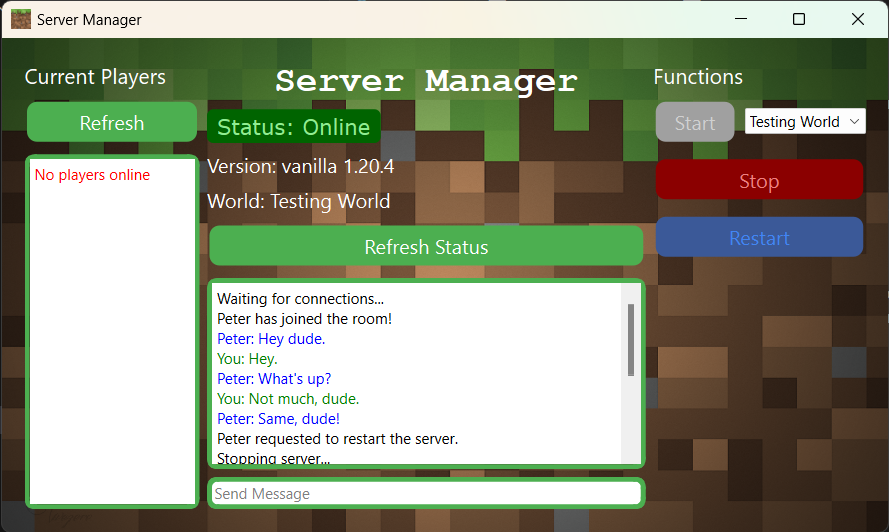

# Minecraft Manager

### About
This is a Java Minecraft server manager that allows for basic control of the server being run on a host's machine by the host and others on the same network. If the host has multiple server worlds available on their machine, clients can select a world to run. 
  
](Images/window.png)

### Features
Through this manager both the host and clients will have the ability to
- Start an available world in the dropdown
- Stop or restart a currently running server
- Query the current players on the server
- Query the current status of the server including the version and the world name
- Chat with others connected to the manager
  
The host has the ability to choose what worlds he would like the clients to be able to choose from.

### Host Instructions
If you are hosting the server on your computer, you must have your manager_host executable running for others to be able to control the server.
  
The first time you run the manager, it will create a file called `manager_settings.json`. Inside this file it will save the names of the clients connecting to your manager and will store the paths to your server worlds. 

**<u>Adding a world</u>**  
In order to add a world to the manager, go to your server folder and copy the path to your `.bat` run file. In the manager settings, add the name of your world and path to the bat in the `"worlds"` section.
``` json
{
    "names":{},
    "worlds":{
        "Time to Shhweep":"C:\\path\\to\\server\\run.bat",
        "Hardcore Parkour":"C:\\the\\other\\run.bat",
        "Sir Vive Al of South Blockington":"C:\\run.bat"
    }
}
```