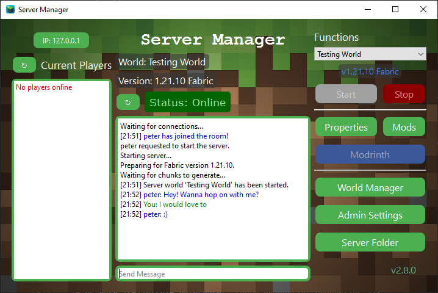

# Minecraft Manager
***Peter Vanderhyde, 2024***

## Description
This is a Java Minecraft server manager that allows for basic control of the server being run on a host's machine by the host and others on the same network. If the host has multiple server worlds available on their machine, clients can select a world to run. It will even handle worlds that are different versions.
  


## Features
Through this manager both the host and clients will have the ability to
- Start an available world in the dropdown
- Stop or restart a currently running server
- Query the current players on the server
- Query the current status of the server including the version and the world name
- Chat with others connected to the manager
  
The host has the ability to choose what worlds he would like the clients to be able to choose from, including worlds running fabric mods.

## Host Instructions
If you are hosting the server on your computer, you must have your manager_host executable running for others to be able to control the server.
  
### Step 1
**<u>Creating the Server Folder</u>**  
First, if you have not already, you need to set up your server folder. To do so, you will need to download a `server.jar` file. A good place to find the version you want is [MCVersions.Net](https://mcversions.net/). If you need instructions on how to set up the server, there are several resources online that you can easily find.

### Step 2
**<u>Initial Startup</u>**  
Run the `Host_manager.exe` file. The first time you run the manager, it will create a file called `manager_settings.json` and will also show an error.`"Server Path is Invalid"`. This just indicates that you haven't specified the path of your server folder yet in the settings. Inside the settings file, it will save the IP you are hosting from (defaults to localhost), the displayed names of the clients connecting to your manager, and will store the names of the server worlds you choose. 

#### Example manager_settings.json
``` json
{
    "ip":"127.0.0.1",
    "names":{},
    "server folder": {
        "path": "C:\\Put\\server\\path\\here",
        "worlds": {
            "Time to Shhweep": {
                "version": "1.18.2"
            },
            "Hardcore Parkour": {
                "version": "1.20.4",
                "fabric": true
            },
            "Sir Vive Al of South Blockington": {
                "version": "1.19.1"
            }
        }
    }
}
```

### Step 3
**<u>Setting the Server Path</u>**
Once you've run the manager, you can open `manager_settings.json` and put the path to your server folder in the quotes. Once you have done that, the manager will create a `worlds` folder in your server folder and should open with no issues. If you still get an error `Unable to Start Manager`, this means the manager was unable to host a server on the given IP address in the settings.

**<u>Changing the Host IP</u>**  
To change the ip that you are hosting from, simply change the `ip` value in the created manager settings.

**<u>Adding a World</u>**  
In order to add a world to the manager, you can either use an existing world folder, or the world folder that was created in the server directory when running the server for the first time. Place the world folder in the `worlds` directory created in your server directory. Next, add the world folder name in the `"worlds"` section of the settings file. Include the version number. Optionally, specify whether it is a fabric server (defaults to false).

#### Example
``` json

"worlds": {
    "My World": {
        "version": "1.20.4",
        "fabric": true
    },
    "First Survival": {
        "version": "1.16.1"
    }
}
```
#### Setting up Fabric
If you want to run a fabric world through the manager, go to [This Link](https://fabricmc.net/use/server/) to download the correct fabric-server.jar file version. After downloading the file, leave the name as is and move it to your server folder. The manager can now find the file and use it for fabric worlds of that version.  
  
You can add as many worlds as you would like to the worlds folder. The manager will run each of them in their own version.

### Step 4
**<u>Creating the Batch File</u>**  
This step is required both for fabric and non-fabric worlds as both will use this batch file.  
In the server folder, create a new text file. Inside, enter:  
`javaw -jar server.jar`  
Save it with the `.bat` extension. This creates a batch file which will run the server.  

### You're all set now. Enjoy!