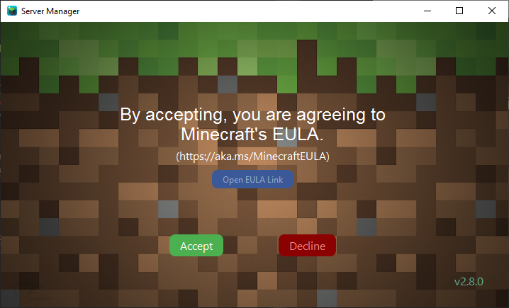
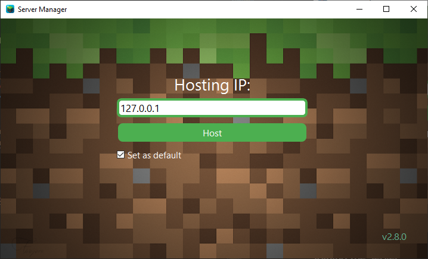

# Minecraft Manager
***Peter Vanderhyde, 2024***

## Description
This is a Java Minecraft server manager that allows for basic control of the server being run on a host's machine by the host and others on the same network. If the host has multiple server worlds available on their machine, clients can select a world to run. It will even handle worlds that are different versions or using fabric.
  


## Features
Through this manager both the host and clients will have the ability to
- Start an available world in the dropdown.
- Stop or restart a currently running server.
- Query the current players on the server.
- Query the current status of the server including the version and the world name.
- Chat with others connected to the manager.
  
The host has the ability to
- Choose what worlds he would like the clients to be able to choose from (including worlds running fabric.)
- Easily add or remove worlds to the available worlds list.
- Create new worlds from scratch to be directly added to the list. Use any version, and optionally set a seed and/or set the world as using fabric.
- Quickly backup server worlds.
- Quick server folder and properties access.

## Host Instructions
If you are hosting the server on your computer, you must have your manager_host program running for others to be able to control the server. You will need the latest Java Runtime (JRE) in order to run the server, so download one if you do not already have it. Different versions require different minimum JRE versions. You can download the latest JRE from [Adoptium Temurin](https://www.adoptium.net/temurin/releases/).
  
### Step 1
**<u>\*Optional\* Creating the Server Folder</u>**  
If you wish to manually create a server folder for the program, you will need to download a `server.jar` file to execute. [MCVersions.Net](https://mcversions.net/) is the simplest place to find any server version. If you need instructions on how to set up the server, there are several resources online that you can easily find.

### Step 2
**<u>Initial Startup</u>**  
Run the `Host_manager.exe` file. The first time you run the manager, it will prompt you to enter the path of the server folder. This can either be the server folder you created in the previous optional step, or you can let the program download and run the latest server file automatically.  
  
If you set up the folder automatically, it will also prompt you to accept the eula.txt.  
  
Your manager is now ready to start hosting a server, but first it will prompt you to enter the hosting ip. This is what the clients will use to connect.  
  
If you set an IP as the default, it will attempt to use that IP address on startup without ever prompting you again.
  
Once you have run the program, it will have created a file called `manager_settings.json`. Inside this settings file, it will save the IP you are hosting from (defaults to localhost), the displayed names of the clients connecting to your manager, the server path, and will store the names of the server worlds you choose. 

#### Example manager_settings.json
``` json
{
    "ip":"127.0.0.1",
    "names":{},
    "server folder": {
        "path": "C:\\server\\path\\here",
        "worlds": {
            "Time to Shhweep": {
                "version": "1.18.2"
            },
            "Hardcore Parkour": {
                "version": "1.20.4",
                "fabric": true
            },
            "Sir Vive Al of South Blockington": {
                "version": "1.19.1"
            }
        }
    }
}
```

### Host Functionality
**<u>Changing the Host IP</u>**  
If you wish to change the ip that you are hosting from but you have already set a default IP, you can change the IP being used at any time with the `Change IP` button in the top left corner.

**<u>Adding a World</u>**  
In order to add a world to the manager, you can either generate a new world, or use an existing world folder.

#### Using an Existing World
Place the world folder in the `worlds` directory created in your server directory. Next, go to `World Options` in the manager and hit `Add Existing`. If this world has been used in the manager in the past, the version number should default to the previous version set. Otherwise, you can select the correct version for the world. Optionally, mark whether it is a fabric server or not.

> Note:  
Setting the world to a higher version than it was created in will likely successfully upgrade the world to a higher version (not guaranteed, though). However, it will never be able to be downgraded again. If you wish to do this, creating a backup of the world first may be recommended.  

After you have added the new world, it will automatically update the list of worlds for yourself and all clients.

#### Generating a New World
Go to the `World Options` in the manager and hit `Create New World`. Enter the world name, a version, a seed (optional), and specify if it is a fabric server. Once you hit `Create World`, the world will be added to the list. However, the world itself will not be generated until the first time the server starts the world.

#
  
You can add as many worlds as you would like to the worlds folder. The manager will run each of them in their own version.

### Step 4
**<u>\*Optional\* Customizing the Batch File</u>**  
There are several arguments that can be given in the server run command such as defining memory space for the server, etc. Feel free to add any extra arguments to the `run.bat` file command. If the run batch file has not already been created, the program will create it upon starting a world. 

### You're all set now. Enjoy!
